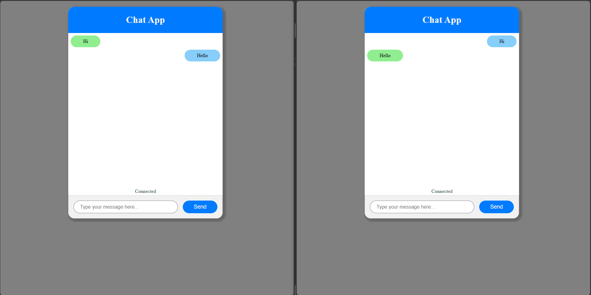
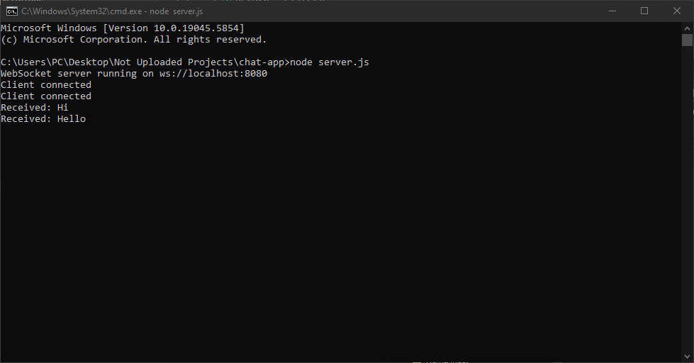

# Basic Chat Application

This project is a basic chat application built with Javascript, using a Node to make a Websocket server. The application allows users to connect to the server, send messages, and receive messages from other users

## Dependencies
- Node.js

## Deployment

To deploy this project, open File Explorer and go into the folder location of the app, then type:

```bash
  cmd
```
Alternatively, run cmd then type:

```bash
  cd enter-the-folder-location-here
```

Then to start the server, run:

```bash
  node server.js
```

Then simply load two instances of the index.html.

## Preview


