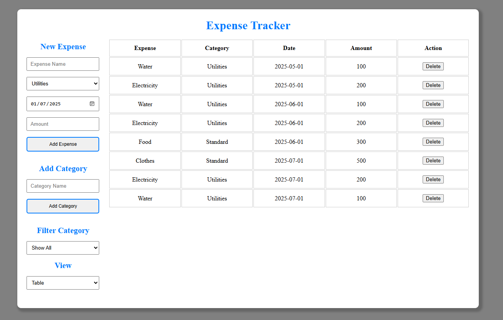
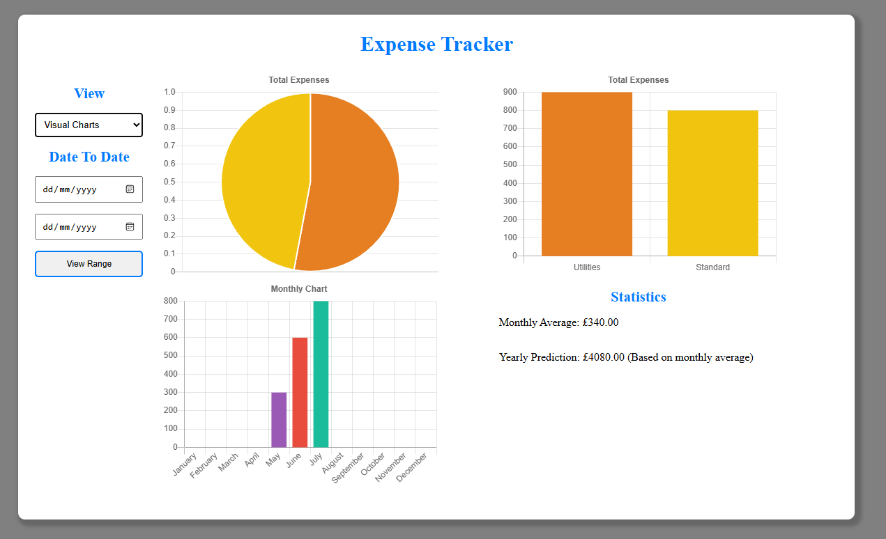

# Expense Tracker

This project is an expense tracker that allows users to add, view, and delete expenses. It uses a simple text-based interface and stores data in the web browser's local storage.

Then it allows the user to change the view to charts that display the data visually, or it allows the user to filter expenses by category.

# Preview

