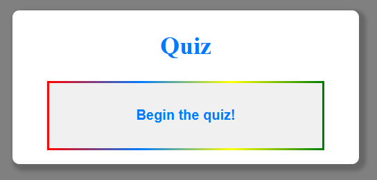
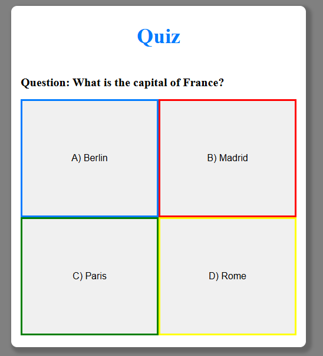
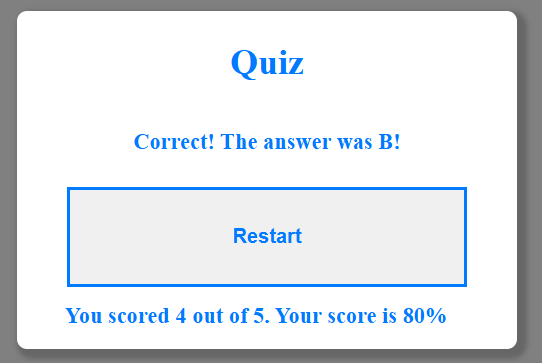

# Simple Quiz

This project is a simple quiz with some randomised questions and answers. The user is asked a series of questions and their answers are checked against the correct answers. The user's score is then displayed at the end, and the ability to restart the quiz.

# Preview

